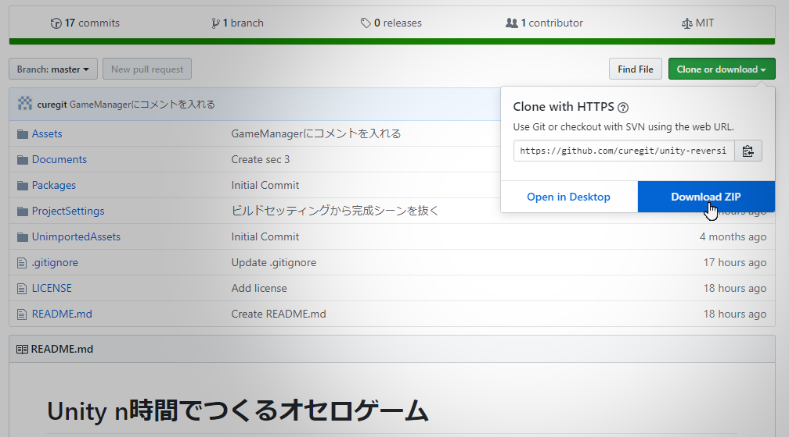
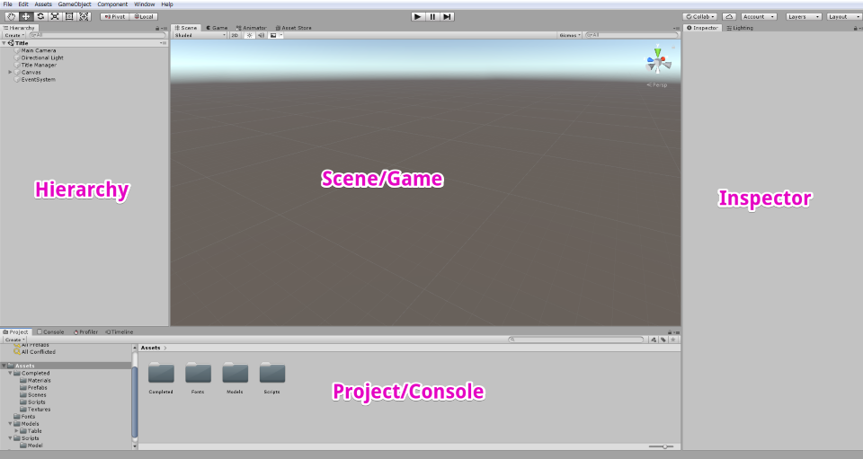
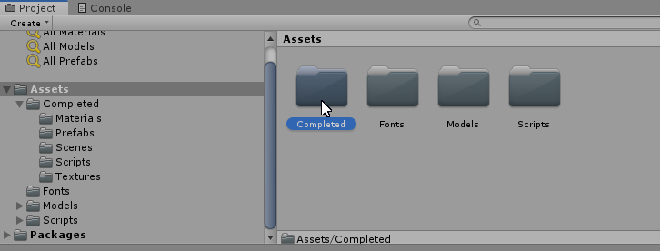
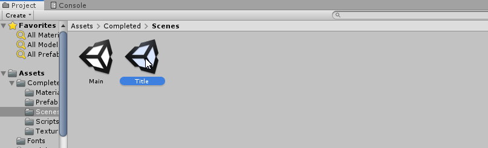
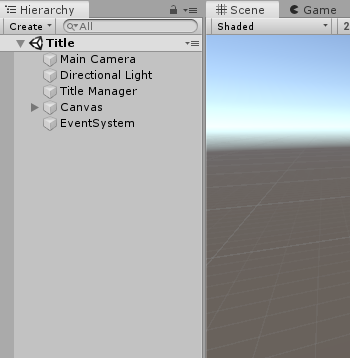
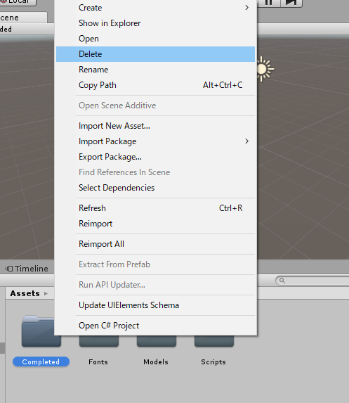
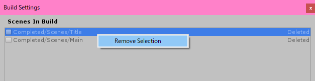

# プロジェクトの読み込み

まず、これから作業するプロジェクトの雛形を開こう。

## プロジェクトの読み込み

この Git リポジトリをクローンあるいは Zip でダウンロードする。

クローン（Zip を適当な場所に解凍）したら、Unity エディタを起動する。
プロジェクトを開くことを選択して、ダイアログでさっきのフォルダを開く。
バージョンの違うエディタを使っている場合は「互換性がないかもしれないけどいいかな？」と聞かれるので Continue を選ぶ（環境によってはバージョンの変更を手動で行う必要がある）。

## プロジェクト構成

- Assets: ゲームの素材（ソースコードも含む）
- Documents: このドキュメント
- Packages: Unity のパッケージマネージャが使用するファイル
- ProjectSettings: プロジェクト全体の設定
- UnimportedAssets: 読者に後でインポートしてもらう素材

今後断りなしにファイルの場所について言及する場合は、Assets の内部の話をしていると考えてほしい。

## エディタの見方

エディタ画面の見方を説明する。
特にそれぞれのビューの名前を覚えておくことはこの先の指示を理解するために重要である。

基本的なビューの名前と用途を以下に示す。

- Scene: シーンを見る、編集する
- Hierarchy: シーンにあるゲームオブジェクトを見る、選ぶ、階層を編集する
- Inspector: オブジェクトの情報を見る
- Project: プロジェクト内のファイル（素材）を見る、選ぶ、操作する
- Console: プログラムのデバッグ
- Game: ゲームを実際に動かす

下の画像と自分のエディタ画面とを照らし合わせてそれぞれのビューがどこにあるか確認されたし。

ビューの名称を覚えておくことは他の Unity の資料を見るときにも役立つだろう。

## 完成品を試遊する

作業をする前に今回作成するオセロゲームの完成状態を見ておこう。

Assets 内に Completed という名前のフォルダが存在する。
このフォルダには完成状態のアセットが含まれている。
Project ビューで Completed フォルダをダブルクリックして内に入ろう。

次に Scenes フォルダをダブルクリックする。
すると Main と Title という 2 つのシーンファイルがあるので、Title をダブルクリックする。
シーンファイルにはオブジェクトなどの初期配置が書かれていると思えばよい。

Hierarchy ビューでタイトルシーンがロードされか確認する。
以下のようになっていたら大丈夫だ。

最後に中央上部の Play ボタン（▶）をクリックしよう。
ゲームがスタートする。

試遊が終わったら作業に移る。

## プロジェクトの整理

まず、この先の作業の邪魔になるので Assets 内にある Completed フォルダを削除またはどこかプロジェクトの外に移動する。
他の場所に移動にしておくと後でコードのカンニングができる。
コーディングセクションをスキップするつもりなら、あとでこのフォルダからソースを引っ張ってきて上書きすればよい。

次にビルド設定からシーンを削除する。
File -> Build Settings を選択して、Scenes In Build に入っている 2 つのシーンを削除する。
これらは試遊のために含めておいたもので、Completed フォルダを削除したために無効になっている。
シーンについては後の章で述べる。

## ノート

- Unity はアセットごとに \*.meta というファイルを生成する。ここには GUID などの重要な情報が書かれているので削除したり、gitignore したりしてはいけない。
- プロジェクトを開くと Library, obj などのフォルダが作られるが、これらは人とプロジェクトを共有するときには必要のないものである。よって gitignore してよい。
