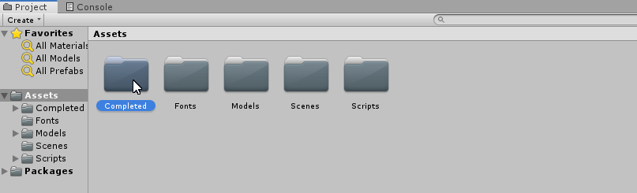
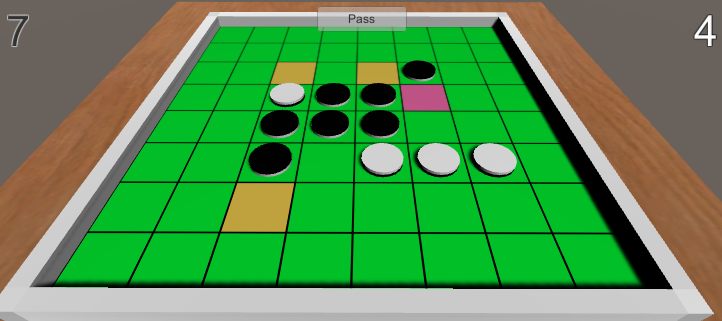

# プロジェクトの読み込み

## プロジェクトの読み込み

このリポジトリをクローンあるいは Zip でダウンロードする。

適当な場所に解凍したら、Unity エディタを起動して解凍したフォルダを開く。
バージョンの違うエディタを使っている場合は「互換性がないかもしれないけどいいかな？」と聞かれるので Continue を選ぶ。

## プロジェクト構成

- Assets: ゲームの素材（ソースコードも含む）
- Documents: このドキュメント
- Packages: Unity のパッケージマネージャが使用するファイル
- ProjectSettings: プロジェクト全体の設定
- UnimportedAssets: 読者に後でインポートしてもらう素材

## エディタの見方

ToDo

## 完成品を試遊する

先に今回作成するオセロゲームの完成状態を見ておこう。

Assets 内に Completed という名前のフォルダが存在する。
このフォルダには完成状態のアセットが含まれている。
Project ビューで Completed フォルダーをダブルクリックして内に入ろう。

次に Scenes フォルダーをダブルクリックする。
すると Main と Title という2つのシーンファイルがあるので、Title をダブルクリックする。
シーンファイルにはオブジェクトなどの初期配置が書かれていると思えばよい。

Hierarchy ビューでタイトルシーンがロードされか確認する。
以下のようになっていたら大丈夫だ。

最後に中央上部の Play ボタン（▶）をクリックしよう。
ゲームがスタートする。

## プロジェクトの整理

まずこの先の作業の邪魔になるので Assets 内にある Completed フォルダを削除またはどこかに移動する。
他の場所に移動にしておくと後でコードのカンニングができる。
コーディングセクションをスキップするつもりなら、あとでこのフォルダからソースを引っ張ってきて上書きすればよい。

## ノート

-

- Unity はアセットごとに *.meta というファイルを生成する。
