# ものを置いてみよう

早速作業に取り掛かろう。
まず3Dシーンの構成方法から覚えよう。

## 新しくシーンをつくる

新しいシーンを作成しよう。
このシーンにゲームのメイン要素を置いていく（すなわちタイトル画面でなくオセロをする画面をつくる）。

メニューバーから File > New Scene を選択する。

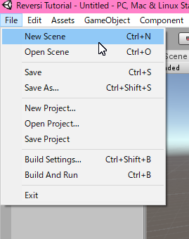

Hierarchy ビューを見よう、空のシーン（と言っても予め置かれるカメラと光源はある）が作られている。

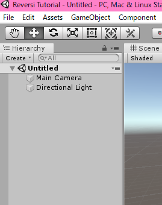

## シーンを保存する

まだ何もしていないが先にシーンファイルを保存してしまおう。
保存場所に決まりはないが、今回は Scenes フォルダを作ってその中に保存しよう。

Project ビューの何もないところを右クリックしてコンテキストメニューを出す。
コンテキストメニューで Create > Folder と選択すると、現在のフォルダにフォルダが作られる。
名前を「Scenes」と入力して確定したら完了だ。

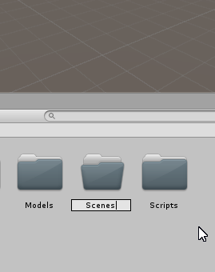

次にシーンファイルをさっき作ったフォルダの中に保存する。

メニューバーから File > SaveAs を選択する。
Scenes フォルダに移動してファイル名を入力して保存する。
ファイル名はメインシーンなので「Main」とする。
ちなみにシーンファイルの拡張子は「.unity」である。

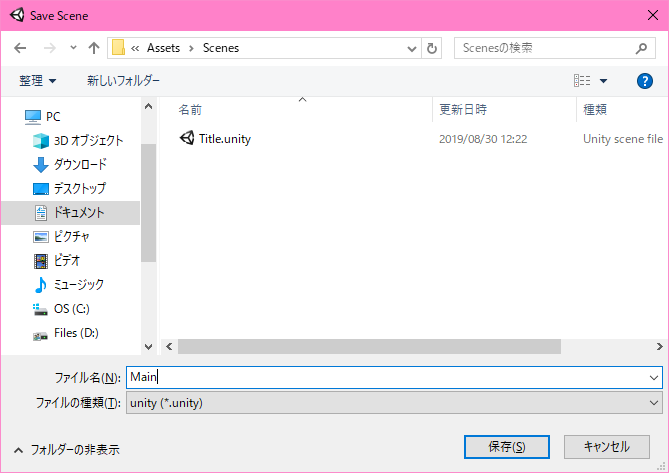

保存されただろうか。
Project ビューで確認できる。

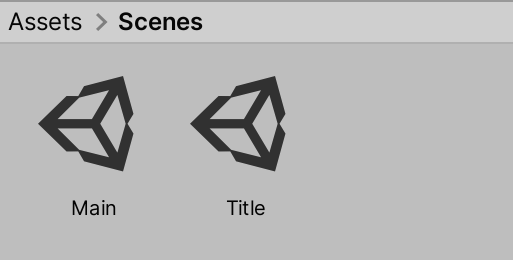

## シーンビュー

シーンビューを少し触ってみよう。
シーンにまだ何も置いていないのでできることは限られているが、まずシーンビューのカメラの動かし方を習得しよう。

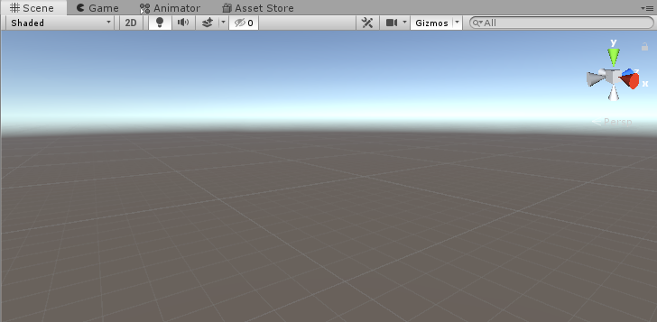

- 右ドラッグでカメラの向きを回転させる。
- ホイールでカメラを寄せたり引いたりできる。
- ミドルドラッグでカメラのパンニング（平行移動）ができる。

このカメラはシーンビューで作業するためのカメラであり、ゲームで使われるカメラとは関係ないことに注意しよう。

## テーブルを置く

オセロ盤の下に用意するテーブルをシーンに置いてみよう。

Project ビューで Models > Table とフォルダを移動するとテーブルのサムネイルを持つファイルがあるだろう。
これがテーブルの3Dオブジェクトであり、これをシーンに置けばレンダラーによってゲーム画面に描画される。

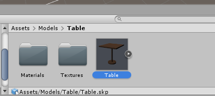

シーンに3Dオブジェクトを配置するにはドラッグアンドドロップが手っ取り早い。
Project ビューに見えている Table.skp を Scene ビューの適当な位置に引っ張って落とそう。

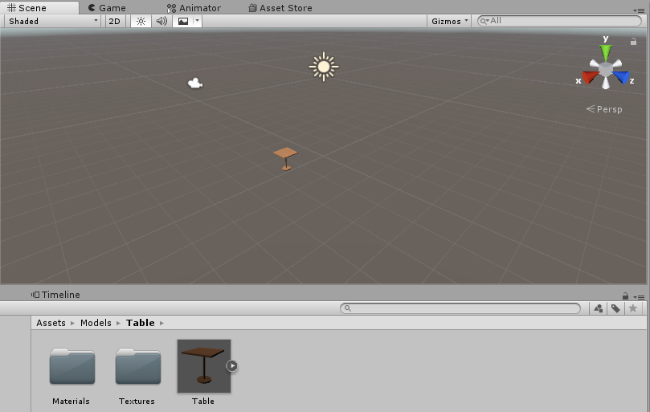

シーンに机が配置されただろうか。

Hierarchy ビューをみると Table が追加されているだろう。

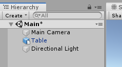

カメラを近くに寄せたりしてみよう。

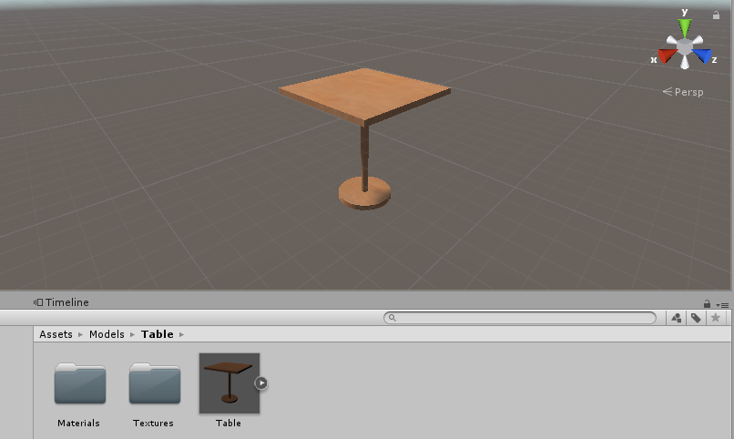

## フォーカスする

配置したオブジェクトを見ていこう。

Scene ビューに見えている机をクリックするか、Hierarchy ビューの Table をクリックすると Table オブジェクトを選択できる。
オブジェクトを選択すると Inspector に様々な情報が表示される。

カメラをオブジェクトに自動でフォーカスさせる方法がある。
オブジェクトを選択した状態で F キーを押してみよう。
あるいは、Hierarchy ビューでオブジェクトをダブルクリックしてみよう。

## Transform を見る

ToDo

## シーンを上書き保存する

机が配置できたところでシーンを保存しよう。
メニューバーの File から Save を選ぶ（あるいは Ctrl+S ショートカットを使う）。

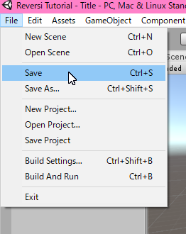

## ノート

- *.skp は SketchUp の3Dデータである。
- Unity は様々な形式の3Dフォーマットに対応している。詳細はマニュアルを参照されたし。
- 複数のシーンを開いている状態で個別に保存したい場合は Hierarchy ビューから行う。
