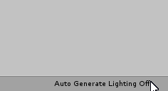

# ものを置いてみよう

早速、本命の作業に取り掛かろう。

まず 3D シーンの構成方法から覚えよう。

## 新しくシーンをつくる

シーンとは大雑把に言うとステージのことで、ゲームの場面の初期配置のようなものである。
例えばスーパーマリオでは、地面とブロックとゴールを用意してマリオをステージの端に置けば（まだ敵がいないけど）ステージの初期配置になる。
これがシーンである。

新しいシーンを作成しよう。
このシーンにゲームのメイン要素を置いていく（すなわちタイトル画面でなくオセロをする画面をつくる）。

メニューバーから File > New Scene を選択する。

Hierarchy ビューを見よう、空のシーン（と言っても予め置かれるカメラと光源はある）が作られている。

## シーンを保存する

まだ何もしていないが先にシーンファイルを保存してしまおう。
保存場所に決まりはないが、今回は Scenes の中に保存しよう。

メニューバーから File > Save As を選択する。
Scenes フォルダに移動してファイル名を入力して保存する。
ファイル名はメインシーンなので「Main」とする。
ちなみにシーンファイルの拡張子は「.unity」である。

保存されただろうか。
Project ビューで確認できる。

これで今後このシーンを編集したとき上書き保存できる。

## GI を有効にする

ここで GI というシーンのライティングに関する設定を変更する。
詳細は述べないが陰になっている部分が見やすくなる。

ウインドウ右下の Auto Generate Lighting Off をクリックする。

一番下の Auto Generate のチェックを有効にする。

## シーンビュー

シーンビューを少し触ってみよう。
シーンにまだ何も置いていないのでできることは限られているが、まずシーンビューのカメラの動かし方を習得しよう。

- 右ドラッグでカメラの向きを回転させる。
- ホイールでカメラを寄せたり引いたりできる。
- ミドルドラッグでカメラのパンニング（平行移動）ができる。

このカメラはシーンビューで作業するためのカメラであり、ゲームで使われるカメラとは関係ないことに注意しよう。

## テーブルを置く

それでは実際にシーンに変化を与える。オセロ盤の下に用意するテーブルをシーンに置いてみよう。

Project ビューで Models > Table とフォルダを移動するとテーブルのサムネイルを持つファイルがあるだろう。
これがテーブルの 3D オブジェクトであり、これをシーンに置けばレンダラーによってゲーム画面に描画される。

シーンに 3D オブジェクトを配置するにはドラッグアンドドロップが手っ取り早い。
Project ビューに見えている Table.skp を Scene ビューの適当な位置に引っ張って落とそう。

シーンに机が配置されただろうか。

Hierarchy ビューをみると Table が追加されているだろう。

カメラを近くに寄せたりしてみよう。

## フォーカスする

配置したオブジェクトを見ていこう。

Scene ビューに見えている机をクリックするか、Hierarchy ビューの Table をクリックすると Table オブジェクトを選択できる。
オブジェクトを選択すると Inspector に様々な情報が表示される。

カメラをオブジェクトに自動でフォーカスさせる方法がある。
オブジェクトを選択した状態で F キーを押してみよう。
あるいは、Hierarchy ビューでオブジェクトをダブルクリックしてみよう。

## Transform を見る

Inspector に現れる情報の中で最も基本的なものの一つにオブジェクトの座標、回転、縮尺がある。
これらは Transform コンポーネントの属性として扱われる。
コンポーネントの概要については次章で触れる。

Table オブジェクトの Transform を見てみよう。
Table オブジェクトを選択して Inspector を見る。

座標、回転、縮尺の値にはそれぞれ Position, Rotation, Scale という名前が付けられており、それぞれの値は 3 次元ベクトルになっている。
これらの値は Inspector で簡単に変更できる。

試しに Rotation の Y に 45 と入れてみよう。
テーブルが水平に 45 度回転するのが確認できる。
Unity の Y 軸は鉛直上向きの軸で、その軸回りに 45 度回転したのである。

ここで今後の作業がしやすくなるので机の位置座標を (-100, 0, 0) に設定しておこう。
回転の値は零ベクトルに戻しておこう。

## テーブルを大きくする

次章の準備としてテーブルの大きさを変える。

配置したテーブルは天板が 60 センチメートルぐらいの大きさである。
この先つくるオセロ盤のマスの一辺は 1 メートル（！）なのでテーブルに収まらない。

Transform のスケール値を弄ってテーブルを大きくしよう。
具体的には Scale ベクトルの全成分を 15 に設定してほしい。

## シーンを上書き保存する

机が配置できたところでシーンを保存しよう。
メニューバーの File から Save を選ぶ（あるいは Ctrl+S ショートカットを使う）。

## ノート

- \*.skp は SketchUp の 3D データである。
- Unity は様々な形式の 3D フォーマットに対応している。詳細はマニュアルを参照されたし。
- 複数のシーンを開いている状態で個別に保存したい場合は Hierarchy ビューから行う。
- Unity は左手系を採用している。
- Unity における物理単位は基本的には SI 準拠であり、例えば位置はメートル(m)、質量はキログラム(kg)が使用される。
- 今回はテーブルを非現実的な大きさにするアプローチをとったが、物理エンジンを利用する場合はこのような誤ったスケーリングが問題になることがある。
