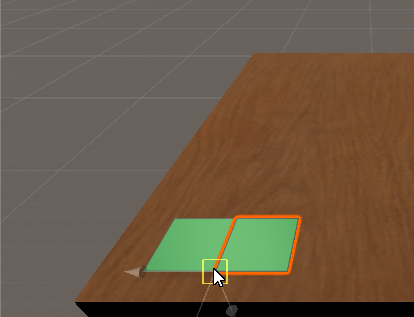
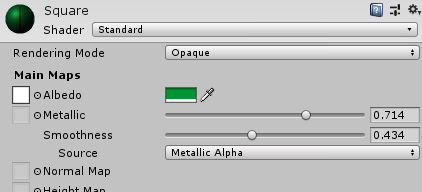
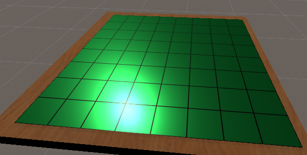
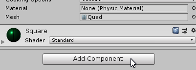
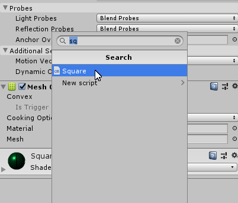
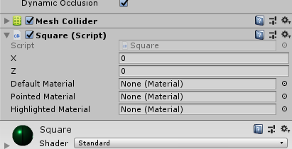
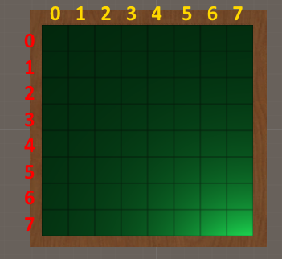
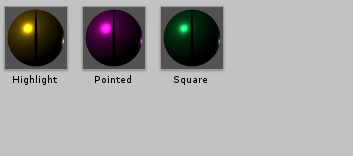
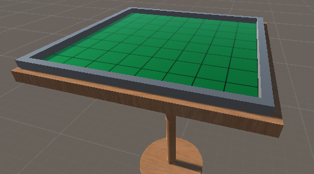

# オセロ盤をつくる

テーブルが置けたところで今度はオセロ盤を作る。

## マスを置く

正方形の板を敷き詰める要領でオセロ盤を作っていく。

机のオブジェクトは外部ソフトでモデリングしたものをインポートしたが、いくつかのプリミティブな3Dオブジェクトであれば Unity で直接生成することができる。
これらのプリミティブなオブジェクトのうちの1つが Quad であり、1辺が 1m の正方形の板になっている。

GameObject > 3D Object > Quad を選択すると、Quad がシーンに適当な位置に配置される。

生成されたQuadは明後日の方向を向いているので、まず板の表が上を向くようにする。
Quad の Transform の Rotation を (90, 0, 0) にする。

次にQuadを机の上の"良い"位置に移動させる。
ツールバーで移動ツールを選択する。

移動ツールを選択しているときは、Scene 上でオブジェクトの Position を変更できる。

Y軸のハンドラ（画像参照）をドラッグすると上下に移動させられる。

X-Z平面のハンドラ（画像参照）をドラッグすると水平に移動させられる。

これらの組み合わせで Quad を下の画像の位置（机の端のちょっと内側）にもってこよう。

## マテリアルをつける

マスをオセロでよくある緑色のビジュアルにしていく。

まずグリッドのテクスチャをインポートする。
Textures フォルダを Assets に作ってそこにインポートしよう。
Textures フォルダ作ったら、UnimportedAssets フォルダにある Square Grid.png を Textures フォルダにコピーする。
このときのコピー作業はエクスプローラー(Finder)でやってもよいし、Square Grid.png ファイルを Project の Textures フォルダにドロップしてもよい。

インポートしたテクスチャの設定を少し変更する。
インポートしたテクスチャを選択し Inspector を見る。
Aniso Levelの項があるので値を 8 に設定する。
設定したら下部の Apply を押すと適用される。

次にマスに模様を適用するためのマテリアルを作成する。
マスは色やテクスチャなどの模様を3Dオブジェクトに与えるためのものである。
先にインポートしたテクスチャもマテリアルを介さずに直接オブジェクトに適用することはできない。
つまり、まずテクスチャをマテリアルに設定し、できたマテリアルを3Dオブジェクトに適用するのである。

マテリアルを作っていく。
マテリアルを保存するフォルダ、Materials を Assets に作る。
Project の Materials フォルダ内でコンテキストメニューを開き、Create > Material を選択する。
名前を Square 等つける。

マテリアルにテクスチャを設定する。
マテリアルを選択し、Inspector の Albedo の左の丸をクリックする。

テクスチャ選択のダイアログが出るので、インポートしたテクスチャを選択する。

テクスチャを設定したら次は色を設定する。
マテリアルの Inspector の Albedo の色選択をクリックして色を設定する。
好きな色にしてもらって構わない。

終わったら Project のマテリアルを Scene の Quad 上にドラッグしてドロップすればマテリアルが適用させる。

## マスの親をつくる

Quad を複製してマスを張っていきたいが、その前に複製した Quad をまとめるためのノードを作る。

Hierarchy はその名が示しているように、ゲームオブジェクトに階層を持たせることができる。
関連のあるオブジェクトを同じ親の子にしておけば、Hierarchy が散らからなくて済む。

Hierarchy ビューでコンテキストメニューを開き、Create Empty を開くと空の（Transform 以外の機能を持たない）ゲームオブジェクトが作成させる。

ゲームオブジェクトの名前は Board 等適当につけるとよい。
Hierarchy ビューで Quad をドラッグして Board にドロップすれば、Quad は Board の子になる。

## マスを張る

それではマスを複製しよう。
Quad を選択して Ctrl+D を押すと内容の同じ Quad が同じ位置に生成される。
全く同じ位置に作られるので Scene では分からないが、Hierarchy を見れば複製されたことが分かる。

つぎに、2つのマスをぴったりくっつける。
移動ツールでどちらかの Quad を右に移動させる。

移動ツール中に Vキー を押下している間は特別な移動モードになり、頂点同士をくっつけるような移動ができるようになる。
右の Quad を選択したまま移動ツールで Vキー を押し続け、カーソルを右の Quad の左下の頂点に近づける。

頂点を捉えたら左向きにドラッグを開始して、左の Quad の右下の頂点に接着させる。

これを繰り返してマスを張っていく。
今度は2つの Quad をまとめて複製しよう。
Ctrl を押しながらのクリックでオブジェクトを複数選択できるので（あるいは Hierarchy で Shift を使って範囲選択する）、2つの Quad を選択する。

複数選択した状態で Ctrl+D による複製を行うと、選択しているすべてのオブジェクトの複製が作られる。

複数選択したまま頂点接着の移動をしていく。

以後倍々でマスを複製して 8x8 盤になるまで続ける。

## マスの質感を調節する

少しマテリアルで遊んでみよう。

Standard Shader のマテリアル（デフォルトで作られるマテリアル）は材質に基づいて陰をつけており、Metallic（金属味）と Smoothness（滑らかさ）のパラメーターを変更すると光の反射の仕方を変えられる。
マスのマテリアルの Inspector から Metallic と Smoothness を変更して好きな見た目になるようにしよう。

画像では光沢が増すような設定にしている。

## スクリプトをアタッチする

ここまではビジュアル部分を作ってきたが、ここでオセロ盤の動作を定義するプログラム部分を仕込んでいく。
オセロ盤のプログラムは完成しているので、この章でするのはそれを紐付けるだけである。
読者には次章でコーディングをしてもらう。

さてオセロ盤のプログラムとは言ったが、実態は1マスごとにマスの動作を定義したコンポーネントを与えるというものである。
Unity ではこのような、小さい単位の機能を実装したコンポーネント（スクリプト）をゲームオブジェクトに与えて動作を作っていくやり方が基本である（もちろんこの方法でうまくいかないこともある）。
ゲームオブジェクトにコンポーネントを与えることをアタッチ（する）という。

実際にやってみよう。
すべてのマスにコンポーネントをアタッチしたいので、まずマスのオブジェクトをすべて選択する。
Ctrl キーを使って地道に選択してもよいし、Hierarchy で Shift キーを使って範囲選択をするのでもよい。
Scene をドラッグすると矩形選択ができるのでそれを使ってもよい。
マス以外のものが選択に含まれないように注意しよう。

選択出来たら Inspector の一番下にある Add Component をクリックする。

検索欄に sq と打ち込むと Square スクリプトが出てくるのでそれを選ぶ。

すると、すべてのマスの Inspector に Square が追加される。
いくつか設定フィールドがあることも分かる。
次節でこれらに値を設定する。

## スクリプトの値を設定する

## 枠をつくる

最後にオセロ盤の枠を作る。
この節は見た目の問題でしかないのでスキップしても構わない。

GameObject > 3D Object > Cube を選択すると立方体のオブジェクトが作られる。
移動、回転、縮尺ツールを駆使して枠のように配置してみよう。
複製操作、先の頂点接着移動機能も役立つ。

マテリアルも自由に適用しよう。

## ノート

- Aniso Level は異方性フィルタリングの設定である。
- エクスプローラー(Finder)でテクスチャのインポートをしてもよいと言及したが、Assets 内のファイル削除および名前の変更は Project ビューで行うのが望ましい。
