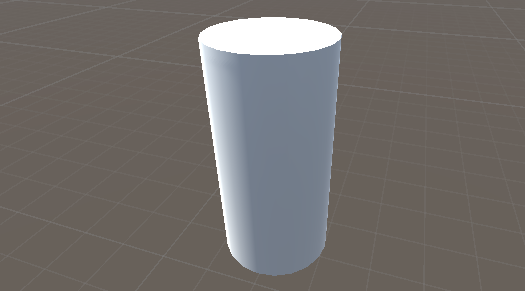

# 石をつくる

盤ができたので今度は石を作る。

## マテリアルの用意

先に石用のマテリアルを作っておく。
これまで通りに黒と白（色は好きなように）のマテリアルを Create する。

## 円柱を変形する

オセロの石はコインのような形をしている。
3Dプリミティブに円柱 (Cylinder) があるのでそれを変形して石にする。

GameObject > 3D Object > Cylinder で円柱を生成する。

Scale を以下の通りする。
Cylinder は直径 1m、高さ 2m であるから Y を0.03倍すると高さが 0.06 m になる。
半径を8割にしているのはそのまま一辺 1m のマスに入れると窮屈だからである。

潰れた円柱が出来上がる。

次に Cylinder から不要なコンポーネントを削除する。
具体的には Inspector から Capsule Collider を除去する。
Collider は物理エンジンの当たり判定用のコンポーネントだが今回は必要ない。
コンポーネントを削除するには、コンポーネントの名前を右クリックして Remove Component を選ぶ。

ここで Cylinder を複製する。
表と裏で色（マテリアル）の塗分けをするためである。
片方を黒、もう一方を白くしたら次のステップへ進め。

## 合体させる

2つの石の片割れが出来たのでそれらを合わせる。

まず空の GameObject ノードを作る。
そして黒と白の Cylinder をそれの子オブジェクトにする。

これで Hierarchy 上は1つのオブジェクトとして扱えるようになった。
親オブジェクトを動かすと子オブジェクトも相対的な位置を保って移動する。

次に子オブジェクトの位置を変更して石の正確な形を整える。

下の図の通りに黒の方の Position をセットする。
子オブジェクトの Inspector の Transform は親ゲームオブジェクトに対しての相対的な値を表している。
よってこれは親ゲームオブジェクトに対して Y を +0.03 した位置に置くという意味である。

そして白い方の相対位置も変更する。

正確に接着した石ができただろうか。

親ノードの中心が石の中心になっているところが、石の回転をさせるのに都合がよい。

## コンポーネントをつける

## コーディング

## プレハブ化

## ノート

