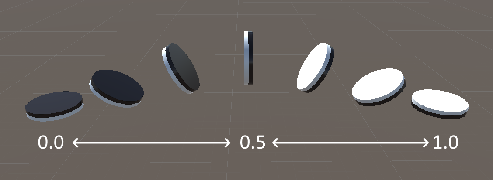

# 石をつくる

盤ができたので今度は石を作る。

## マテリアルの用意

先に石用のマテリアルを作っておく。
これまで通りに黒と白（色は好きなように）のマテリアルを Create する。


## 円柱を変形する

オセロの石はコインのような形をしている。
3D プリミティブに円柱 (Cylinder) があるのでそれを変形して石にする。

GameObject > 3D Object > Cylinder で円柱を生成する。


Scale を以下の通りする。
Cylinder は直径 1m、高さ 2m であるから Y を 0.03 倍すると高さが 0.06 m になる。
半径を 8 割にしているのはそのまま一辺 1m のマスに入れると窮屈だからである。


潰れた円柱が出来上がる。


次に Cylinder から不要なコンポーネントを削除する。
具体的には Inspector から Capsule Collider を除去する。
Collider は物理エンジンの当たり判定用のコンポーネントだが今回は必要ない。
コンポーネントを削除するには、コンポーネントの名前を右クリックして Remove Component を選ぶ。


ここで Cylinder を複製する。
表と裏で色（マテリアル）の塗分けをするためである。
片方を黒、もう一方を白くしたら次のステップへ進め。


## 合体させる

2 つの石の片割れが出来たのでそれらを合わせる。

まず空の GameObject ノードを作る。
そして黒と白の Cylinder をそれの子オブジェクトにする。


これで Hierarchy 上は 1 つのオブジェクトとして扱えるようになった。
親オブジェクトを動かすと子オブジェクトも相対的な位置を保って移動する。

次に子オブジェクトの位置を変更して石の正確な形を整える。

下の図の通りに黒の方の Position をセットする。
子オブジェクトの Inspector の Transform は親ゲームオブジェクトに対しての相対的な値を表している。
よってこれは親ゲームオブジェクトに対して Y を +0.03 した位置に置くという意味である。


そして白い方の相対位置も変更する。


正確に接着した石ができただろうか。

親ノードの中心が石の中心になっているところが、石の回転をさせるのに都合がよい。


## コンポーネントをつける

石の振る舞いを持たせるために、コンポーネントをつける（前章のスクリプトアタッチと同じ）。
石の振る舞いとは、ひっくり返されるアニメーションなどである。
石の親ノードに Disk スクリプトをアタッチする。


アッタチしたら 1 つフィールドを編集する必要がある。
Thickness は石の厚さを表しており、これを 0.12 に設定する。

## コーディング

ここでいよいよ C# プログラムを書く。
演習のために Disk スクリプトは一部が未実装となっている。
それらを完成させよう。

Assets/Scripts/Disk.cs を好きなエディタで開く。
Update メソッドを見て、TODO となっている箇所を確認せよ。
Update メソッドは Unity によって、ゲームの 1 フレームごとに 1 回呼ばれるメソッドである。

### アニメーション割合の変化量を計算

石をひっくり返すときに、黒と白の間を行き来するアニメーションを考える。
アニメーションの変化において、黒の状態を 0、白の状態を 1 と定義する。



まずこのフレーム（コマ）における、アニメーション変化量を計算する。
アニメーション変化量とはフレームにおいてアニメーションの状態の数値の増減の大きさのことである。
アニメーションの 0 から 1 への変化にかかる時間（秒）がフィールド animTime で定義されている。
このフレームにおいて経過する時間（秒）は Time.deltaTime で取得できる。
このフレームにおいて発生しうる最大の（0 と 1 に近すぎる場合はみ出しても良いという意味）アニメーション変化量の大きさを変数 delta に代入せよ（正の値となる。アニメーション最中でないとかは考えなくて良い。）。

<details>
<summary>回答例</summary>

```cs
var delta = Time.deltaTime / animTime;
```

</details>

### 現在のアニメーション割合を求める

次に、このフレームにおいて到達するアニメーション割合を求める。
現在のアニメーション状態は変数 animDarkToLight が表している。
目標となるアニメーション状態（0 か 1 か）は変数 destination が保持している。

Mathf.MoveTowards(x, y, z) 関数は、x を y の方に z だけ近づけた値を返す。
例えば、Mathf.MoveTowards(0.1, 0.5, 0.2) は 0.3 を返す。
x と y の間が z より小さい場合、y を通り越してしまうことはなく、y が返される。

Mathf.MoveTowards によって、現在のアニメーション割合 animDarkToLight に新しい値を代入する式の骨組みを用意した。
Mathf.MoveTowards に引数を正しく与えて、式を完成させよ。

<details>
<summary>回答例</summary>

```cs
animDarkToLight = Mathf.MoveTowards(animDarkToLight, destination, delta);
```

</details>

### アニメーション割合に応じて球面線形補間によって回転させる

現在のアニメーション状態を石に適応する。
まず、石の回転を更新する。

黒と白の回転状態を表す値の間をとることで回転を更新する。
Quaternion.Slerp 関数は、回転姿勢を線形に補間した値を返す。
Quaternion.Slerp(A, B, t) は回転姿勢 A と回転姿勢 B の間を t (0 ～ 1) で補間した値を返す（t が 0 のとき A、1 のとき B）。
A と B は Quaternion と呼ばれる 4 要素の値である（複素数の拡張）。
Quaternion.Slerp も Quaternion の値を返す。

石が黒および白の状態（中途でない）における回転の値は、darkRotation と lightRotation が保持している。
これらは 3 次元ベクトル（Vector3）型であり、Quaternion でないため変換する必要がある。
Quaternion.Euler(V) 関数は 3 次元ベクトル V を渡すと、変換した Quaternion を返す。

オブジェクトの回転は transform.rotation に Quaternion の値を代入すれば更新できる。
transform.rotation に新しい回転の値を代入して石の回転を更新せよ。

<details>
<summary>回答例</summary>

```cs
transform.rotation = Quaternion.Slerp(Quaternion.Euler(darkRotation), Quaternion.Euler(lightRotation), animDarkToLight);
```

</details>

### 盤面上の位置を求める

次に、石の位置を更新する。
ひっくり返すときに石を上へフワッと浮かせるためである。
そのために、盤面上のマスからの上方向への相対的な位置（位置ベクトル）を求める。
そしてその値を新しい変数 pos に代入する。

石をフワッと浮かせるために正弦波を利用する。
黒のとき位相 0 度、白のとき位相 180 度として正弦波の値を使うことで、それっぽいアニメーションになる。
正弦関数は Mathf.Sin(x) が使用可能であり、引数 x はラジアンである。
円周率は Mathf.PI で定義されているものが使える。
山の高さ（振幅）は flipHeight で定義されている。

オセロの石のオブジェクトの中心（ピボット）は、実際の石の中心となっており、石の位置の値を盤のマスの中心にしてしまうと、石が盤に埋まってしまう。
したがって、pos は石の厚さの半分の分だけ上にずらしておく必要がある。
石の厚さは変数 thickness で読み取れる。

この実装においては、定数 Vector3.up を使うと良い。
Vector3.up は上方向への単位ベクトル (0, 1, 0) を表す。
ベクトル同士はスカラーの数値同様、演算子 + で足すことができる。
ベクトルとスカラーに、演算子 `*` を適用することによって定数倍したベクトルを得られる。
変数の宣言は、先ほど delta を宣言したときのように、var キーワードによって行うと良い。

<details>
<summary>回答例</summary>

```cs
var pos = Vector3.up * thickness / 2 + flipHeight * Vector3.up * Mathf.Sin(Mathf.PI * animDarkToLight);
```

</details>

### アニメーション位置も含めた位置を求めて移動させる

pos は石のあるマスからの相対的な位置ベクトルなので、石の位置を更新するためには石のあるマスの座標を足しこむ必要がある。
square.Position() によって、石のあるマスの座標を取得できる。
transform.position に更新された石の位置を代入せよ。

<details>
<summary>回答例</summary>

```cs
transform.position = square.Position() + pos;
```

</details>

## プレハブ化

石作りの最後にプレハブ化を行う。
プレハブとは、後で同じものを複製して利用する（例えば、クリボーのような雑魚敵オブジェクト）ための再利用可能なオブジェクトである。

Project ビューで Assets に Prefabs フォルダを作る。
Hierarchy ビューで石の親ノードを選択して、Project の Prefabs 内部にドラッグしてドロップする。
そうすると、石のプレハブが作られる。


これで、プレハブの石をゲーム中に複製して使うことができる。
シーンにある石は必要ないので削除しよう。

## ノート

- プレハブは単純な機能だが、ゲーム開発においては結構役立つ。
