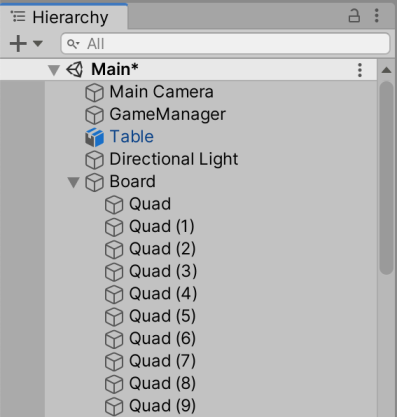
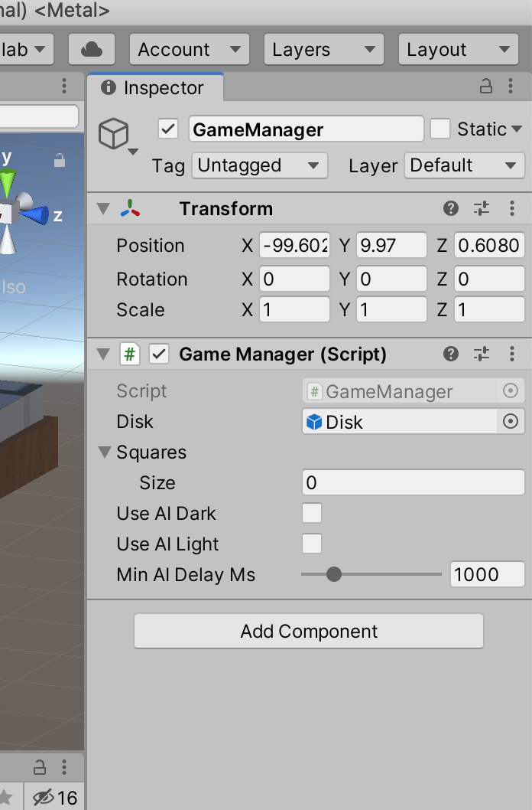
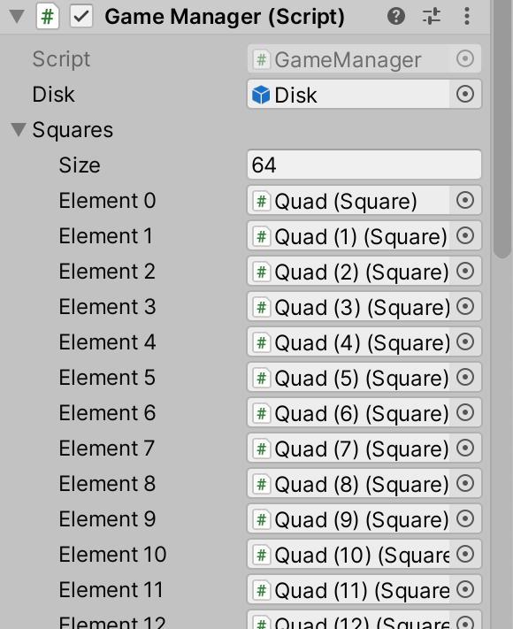
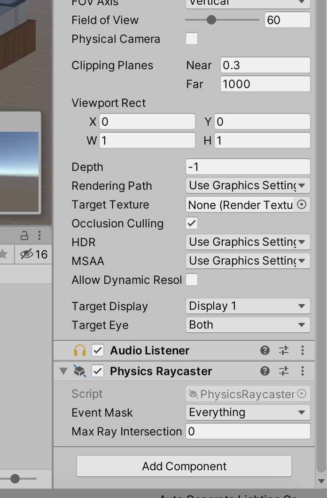
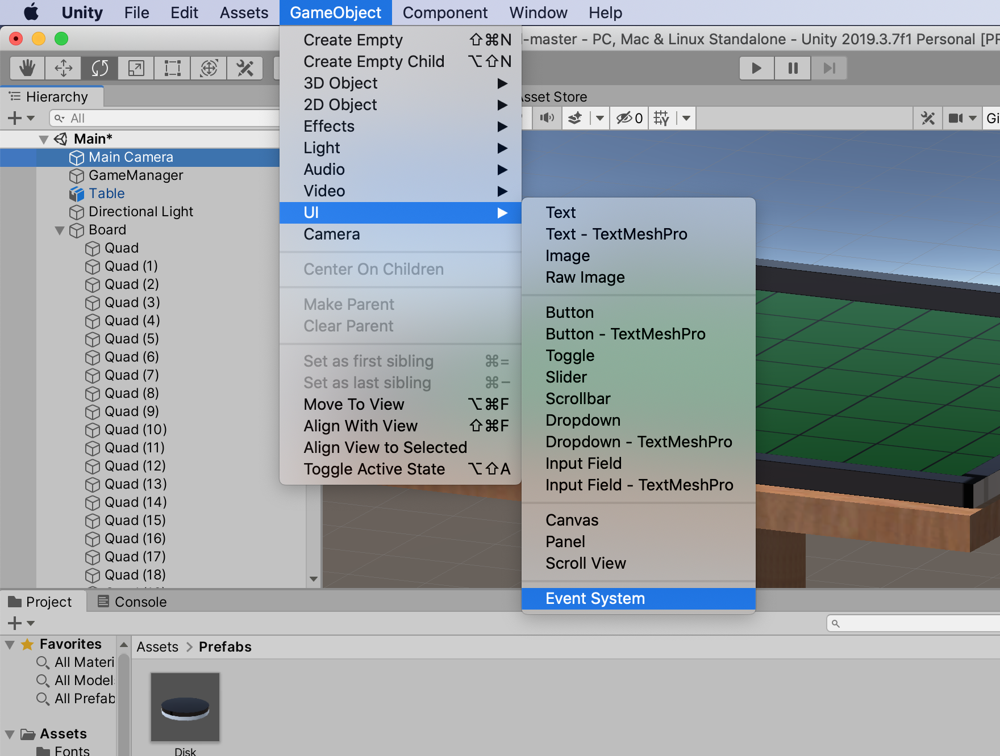
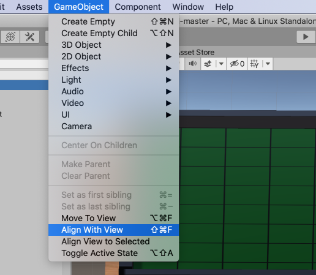
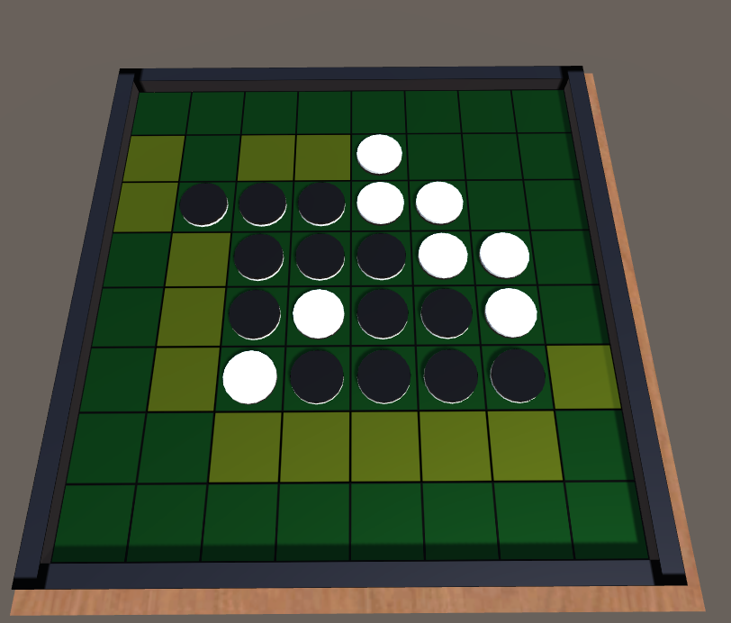

# プレイしてみる

石と盤ができて、ゲームはほとんど完成した。
最後に、シーンに必要な残りのものを揃える。

## ゲームマネージャを用意する

まず、ゲームマネージャを用意する。
ゲームマネージャはゲームの進行を管理する司会者のような存在で、プレイヤーのターン管理などをやってくれる。

空のゲームオブジェクトを GameManager という名前で作る。

そして、GameManager オブジェクトに GameManager スクリプトをアタッチする。
さらに、GameManager スクリプトにおいて、石のプレハブを Disk フィールドに設定する。
先に作った Project ビューの Disk プレハブをドラッグして（あるいはダイアログで選択する）こればよい。

GameManager の Squares に盤のマスをすべて登録する。
GameManager の Inspector で右上の鍵のアイコンをクリックする。
Inspector 右上の鍵のアイコンをクリックすると、他のオブジェクトを選択しても Inspector が切り替わらなくなる。
この状態で、Hierarchy のマスのオブジェクト（64 個）を選択し、Squares にドラッグして落とす。
下のように 64 個登録されていたら OK だ。
最後に鍵を外すのを忘れないように。

## Raycaster と Event System

Physics Raycaster を Main Camera に設定する。
Physics Raycaster はマウスからマスへのポインティングを処理してくれる。
Main Camera オブジェクトに Physics Raycaster コンポーネントを追加する。

EventSystem をシーンに配置する。
クリックイベントなどの処理をするのに必要である。

## カメラの調整

シーンビューでオセロをプレイしやすい位置と向きにカメラを合わせる。
合わせたら、Hierarchy で Main Camera を選択する。
その状態でメニューバーから GameObject -> Align With View を選択する。
そうすると、Main Camera がシーンのカメラと同じところを映すようになる。

## プレイする

ここまでの作業によって、ゲームをプレイできるようになっているはずだ。
Play ボタン（▶）をクリックして確かめてみよう。
黒と白どちらの番でもプレイヤーが操作しなければならない。
オセロの終局面までゲームを進行できれば問題ない。

## AI と勝負する

GameManager の useAI という項目は有効にすることで AI に操作させることができる。
useAI はゲームの再生を開始した後で有効にする必要がある（後に使うタイトル画面からの遷移を処理するスクリプトによって上書きされるため）（useAI はゲーム進行途中で無効化するとバグる可能性あり）。

プレイしていると、人間プレイヤーに置ける場所がないとき、パスできないことに気づくだろう。
パス操作を行えるように次章ではユーザインタフェースの設置を行う。

## ノート

- 本資料の AI にはミニ・マックス法という古典的な手法が使われている。気になる人は調べてみよう。
