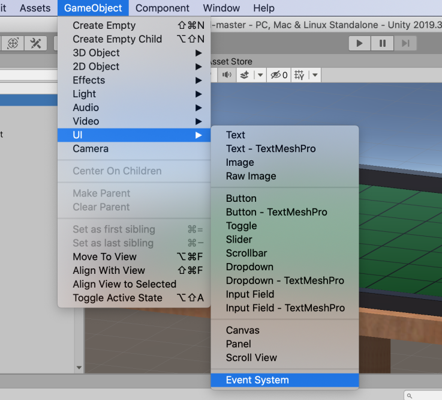

# プレイしてみる

石と盤ができて、ゲームはほとんど完成した。
最後に、シーンに必要な残りのものを揃える。

## ゲームマネージャを用意する

ターンの管理などをやってくれる。

空のゲームオブジェクトを GameManager という名前で作る。

そして、GameManager オブジェクトに GameManager スクリプトをアタッチする。
さらに、GameManager スクリプトにおいて、石のプレハブを Disk フィールドに設定する。
先に作った Project ビューの Disk プレハブをドラッグして（あるいはダイアログで選択する）こればよい。

右上の鍵のアイコンをクリックすると、他のオブジェクトを選択しても Inspector が切り替わらなくなる。

## Raycaster と Event System

## カメラの調整

## プレイする
