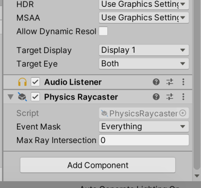

# プレイしてみる

石と盤ができて、ゲームはほとんど完成した。
最後に、シーンに必要な残りのものを揃える。

## ゲームマネージャを用意する

まず、ゲームマネージャを用意する。
ゲームマネージャはゲームの進行を管理する司会者のような存在で、プレイヤーのターン管理などをやってくれる。

空のゲームオブジェクトを GameManager という名前で作る。

そして、GameManager オブジェクトに GameManager スクリプトをアタッチする。
さらに、GameManager スクリプトにおいて、石のプレハブを Disk フィールドに設定する。
先に作った Project ビューの Disk プレハブをドラッグして（あるいはダイアログで選択する）こればよい。

GameManager の Squares に盤のマスをすべて登録する。
GameManager の Inspector で右上の鍵のアイコンをクリックする。
Inspector 右上の鍵のアイコンをクリックすると、他のオブジェクトを選択しても Inspector が切り替わらなくなる。
この状態で、Hierarchy のマスのオブジェクト（64 個）を選択し、Squares にドラッグして落とす。
下のように 64 個登録されていたら OK だ。
最後に鍵を外すのを忘れないように。

## Raycaster と Event System

Physics Raycaster を Main Camera に設定する。
Main Camera オブジェクトに Physics Raycaster コンポーネントを追加する。

Event System をシーンに配置する。
クリックイベントなどの処理をするのに必要である。

## カメラの調整

シーンビューでオセロをプレイしやすい位置と向きにカメラを合わせる。
合わせたら、Hierarchy で Main Camera を選択する。
その状態でメニューバーから GameObject -> Align With View を選択する。
そうすると、Main Camera がシーンのカメラと同じところを映すようになる。

## プレイする

ここまで

## AI と勝負する

GameManager の useAI という項目は有効にすることで AI に操作させることができる。
（ゲーム途中で変更するとバグる可能性あり）
