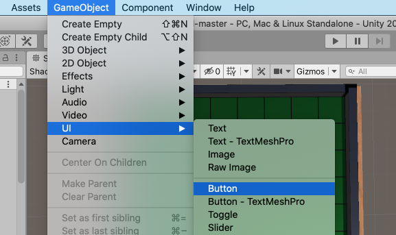
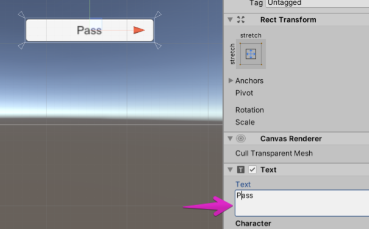

# ユーザインターフェイス

ゲームに必要な HUD を作っていく。

## パスボタンを置く

プレイヤーがパスするときのためのボタンを配置する。

GameObject -> UI -> Button を選択する。



そうすると（UI Canvas）

シーンビュー上部の 2D を押すと


Button の子要素の Text を Pass などに変えておこう。



ボタンにコールバック関数を登録する。
作ったパスボタンを選択し、


UI など適当な名前のゲームオブジェクトを作り、そこに UI スクリプトをアタッチする。

## 石の数を表示する

続いて、ゲーム中に石の数を表示するテキストラベルを作る。


ここで、いくつかコーディングをしてもらう。
Assets/Scripts/UI.cs をテキストエディタで開く。

テキストラベルの参照を持つフィールドを用意する。
フィールドを用意するという TODO の箇所に、以下のようにフィールド変数を用意する。
これで UI スクリプトの Inspector でこのフィールドを編集できるようになる。

```cs
// 黒石の数を表示するテキスト
[SerializeField]
private Text darkDiskCountText = default;

// 白石の数を表示するテキスト
[SerializeField]
private Text lightDiskCountText = default;
```

次に、ゲーム中に石の数の表示を更新する操作を書く。
以下のように Text コンポーネントの text フィールドを書き換えるだけで良い。
Update メソッド内の TODO の箇所を変更しよう。

```cs
// 石の数を更新
darkDiskCountText.text = $"{GameManager.instance.board.Count(Player.Dark)}";
lightDiskCountText.text = $"{GameManager.instance.board.Count(Player.Light)}";
```

2 つの Text コンポーネントを作って、適当な（好きな）位置に置く。
先ほど定義した UI スクリプト（シーンにあるもの）の 2 つのフィールドに今作った Text を登録したら完了だ。

## リザルト演出を用意する

先ほどやった要領で Text と 2 つの Button をシーンに用意する。

それらを一つの親ノードのもとにまとめておく。


UI スクリプトの GameEndDialog に親ノードを、ResultText に Text を設定しておく。

## テストする

ここまできたら UI をテストしてみよう。

## ノート
