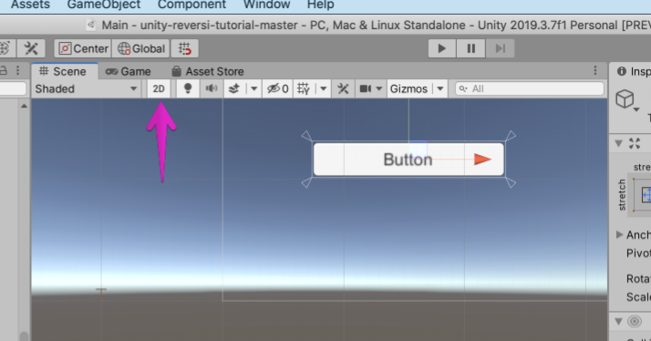
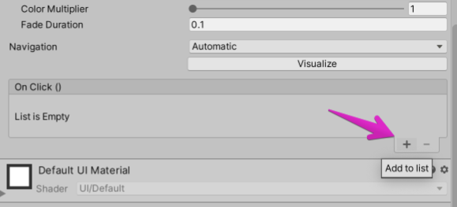
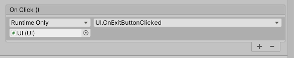

# ユーザインターフェイス

ゲームに必要な HUD を作っていく。

## パスボタンを置く

プレイヤーがパスするときのためのボタンを配置する。
メニューから GameObject -> UI -> Button を選択する。
そうすると UI 要素の Button が作られる（ついでに必要な Canvas も作られる）。


ここで 2D モードに切り替えて、設置されたボタンを確認しよう。
シーンビュー上部の 2D を押すと 2D モードに切り替わる。
2D モードは、専ら UI を作るとき、または 2D ゲームを作るときに使う。



UI 要素は通常のオブジェクトとは少し異なる Transform を持つが、移動ツールなどは同じように使用できる。
ボタンを好きな位置（プレイしやすい位置）に移動させておこう。
シーンビューに出ている、白い枠がキャンバスの枠である。

Button に表示されるテキストは Button の子要素の Text コンポーネントが指定している。
Text ゲームオブジェクトの Text コンポーネントの Text フィールドの文字列を Pass などに変えておこう。


ボタンをクリックしたときに処理を走らせるため、ボタンにコールバック関数を登録する。
作ったパスボタンを選択し、Button コンポーネントの OnClick に項目を追加する（Add to list を押す）。



追加した項目にシーンの GameManager を登録し、GameManager -> Pass メソッドを選択する。
これでボタンクリック時に Pass メソッドが呼び出される。


## UI 制御スクリプトの配置

UI 制御を行うスクリプトを用意する。
TODOTODO
UI など適当な名前のゲームオブジェクトを作り、そこに UI スクリプトをアタッチする。

## 石の数を表示する

続いて、ゲーム中に石の数を表示するテキストラベルを作る。
メニューから GameObject -> UI -> Text を選択すると Text オブジェクトが作られる。
2 つの Text オブジェクト（それぞれで黒と白の石の数を表示する）を作って、ボタンと同じように適当な（好きな）位置に置く。


これらの Text を UI スクリプトに制御させれば完了だが、UI スクリプトはこれらに関する部分が未完成である。
それなのでここでいくつかコーディングをしてもらう。
Assets/Scripts/UI.cs をテキストエディタで開く。

まず、テキストラベルの参照を持つフィールドを用意する。
フィールドを用意するという TODO の箇所に、以下のようにフィールド変数を用意する。
これで UI スクリプトの Inspector でこのフィールドを編集できるようになる。

```cs
// 黒石の数を表示するテキスト
[SerializeField]
private Text darkDiskCountText = default;

// 白石の数を表示するテキスト
[SerializeField]
private Text lightDiskCountText = default;
```

次に、ゲーム中に石の数の表示を更新する操作を書く。
以下のように Text コンポーネントの text フィールドを書き換えるだけで良い。
Update メソッド内の TODO の箇所を変更しよう。

```cs
// 石の数を更新
darkDiskCountText.text = $"{GameManager.instance.board.Count(Player.Dark)}";
lightDiskCountText.text = $"{GameManager.instance.board.Count(Player.Light)}";
```

先ほど定義した UI スクリプト（シーンにあるもの）の 2 つのフィールドに作った 2 つの Text オブジェクトを登録したら完了だ。

## リザルト演出を用意する

TODO 例画像

先ほどやった要領で Text と 2 つの Button をシーンに用意する。

それらを一つの親ノードのもとにまとめておく。


UI スクリプトの GameEndDialog に親ノードを、ResultText に Text を設定しておく。




Click イベントを設定する

## テストする

ここまできたら UI をテストしてみよう。
ただし、シーンの登録をまだしていないので、Retry ボタンと Menu ボタンは機能しない。

## ノート

- ボタンの色などを変えてみよう。
- UI 配置には異なる解像度の扱いなどに注意が必要だが、複雑になるので本資料では扱わない。
